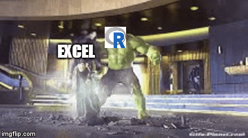
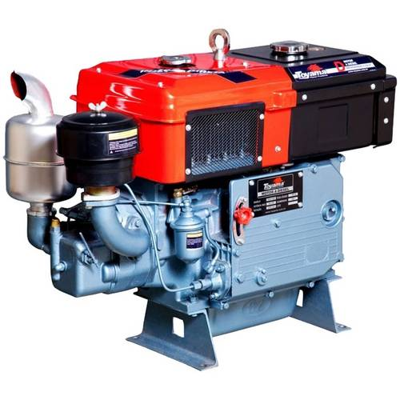
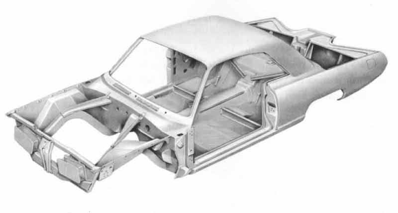
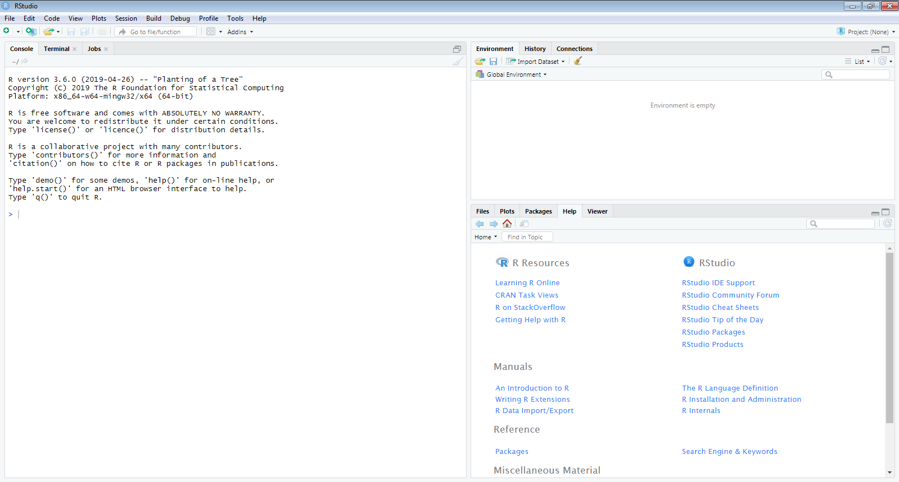
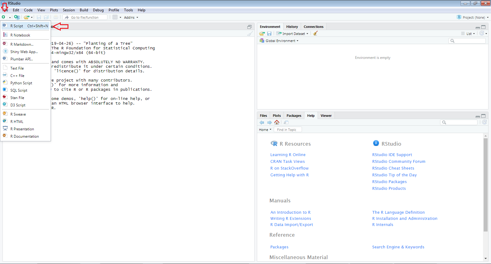
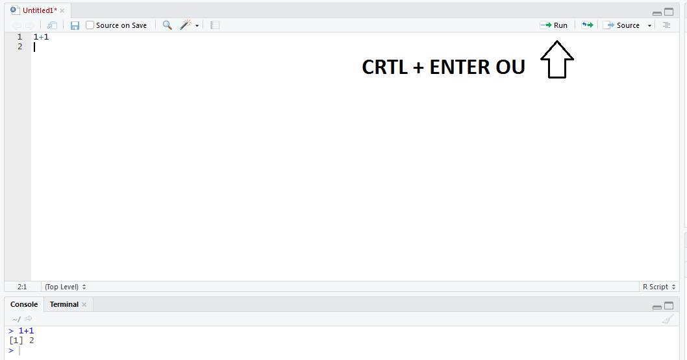
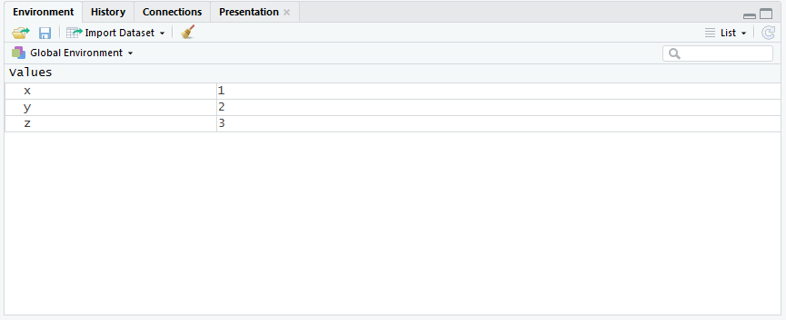
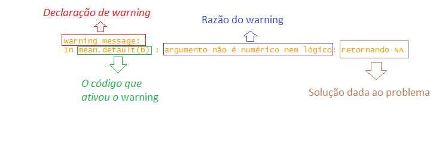
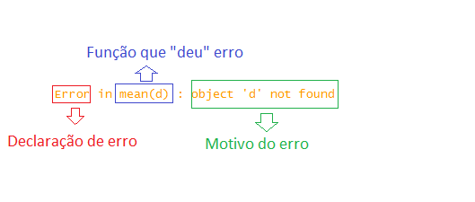
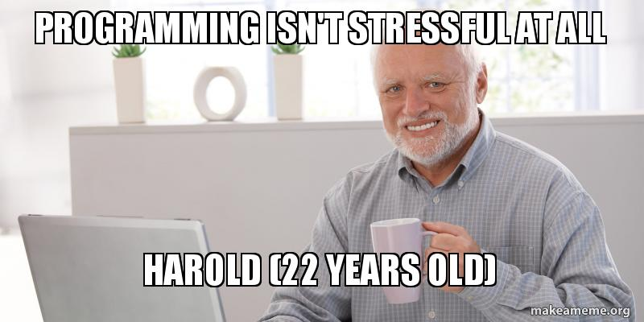

# Apresentação do Curso

## Orientações iniciais

## Motivação

## Desenvolvimento do Curso

Fundamentos - manipulação de dados - visualização de dados - Projeto


# Por que usar a linguagem R?

## O que é o R?

&nbsp;
&nbsp;

O R é uma linguagem de programação voltada, sobretudo, para a estatística e produção de gráficos. No nosso caso, utilizaremos essa linguagem para a automatização de rotinas. 

$~$

E o que é uma linguagem de programação? De maneira superficial, é um conjunto de regras semânticas e sintáticas (uma linguagem, portanto) que nos permite passar instruções para um computador.


## Vantagens de se utilizar o R

&nbsp;
&nbsp;


1. Software livre e de código aberto
$~$

2. Compatibilidade com diversos sistemas operacionais
$~$

3. Suporta extensões (pacotes)
$~$

4. Reprodutibilidade
$~$

5. Comunidade engajada


## R vs. Excel

&nbsp;
&nbsp;

<div style="float: left; width: 50%;">

<center>  </center>

</div>


```{r echo=FALSE}
Rotina=c(0,1,2,3,4,5,6,7,8,9,10,11,12,13,14,15)
Horas=c(0,4,4.1,4.2,4.3,4.4,4.5,4.6,4.7,4.8,4.9,5,5.1,5.2,5.3,5.4)

z <- c(0,0.5,1,1.5,2,2.5,3,3.5,4,4.5,5,5.5,6,6.5,7,7.5)


plot(Rotina,Horas, type="l",lwd=2, col="blue", ylim=c(0,10), main="Comparação entre o tempo gasto para execução de rotinas",
     xlab="Número de execuções de rotinas", ylab="Tempo total em horas")
lines(Rotina,z, col="red", lwd=2, lty=2)
legend(1, 10, legend=c("Linguagem R", "Excel ou similar"),
       col=c("blue", "red"), lty=1:2, cex=0.8,
       title="Tipo de programa utilizado", text.font=4,
       box.lty=2, box.lwd=2, box.col="black")
```


## Onde pesquisar?

&nbsp;
&nbsp;

Caso surja alguma dúvida, seguem abaixo algumas fontes de consulta:


<a href="http://r4ds.had.co.nz/index.html">R for Data Science</a> 

<a href="http://www.cookbook-r.com/">Cookbook for R</a>

<a href="http://adv-r.hadley.nz/">Advanced R</a>

<a href="http://pt.stackoverflow.com/">Stackoverflow</a>

<a href="http://www.ufrgs.br/wiki-r/index.php?title=Bem-vindo_%C3%A0_Wiki_R">Wiki R</a>

<a href="http://material.curso-r.com/rbase/">Curso R</a>

<a href="http://cran.r-project.org/doc/contrib/Landeiro-Introducao.pdf">Introdução ao R</a>


# RStudio


## O que é o RStudio
&nbsp;
&nbsp;

<div style="float: left; width: 50%;">

<p style="text-align:center"> <b> R </b> </p>

<center></center>

</div>

<div style="float: right; width: 50%;">

<p style="text-align:center"> <b> RStudio </b> </p>

<center></center>

</div>

## Conhecendo o RStudio

<center></center>

## Conhecendo o RStudio

<center></center>

## Conhecendo o RStudio

<center></center>

#Primeiros passos no R

## Como nos imaginamos ao programar

&nbsp;
&nbsp;

<div align="center">

<video width="800px" height="700px" controls>
  <source src="people.mp4" type="video/mp4">
</video>

</div>


## Executando códigos
&nbsp;
&nbsp;

Para executar códigos no RStudio, basta digitá-los na janela "Editor" e apertar o botão Run ou utilizar o atalho "Ctrl + enter".

Para executar apenas uma parte específica do código ou mais de uma linha, basta selecionar e depois rodar o código.

<center></center>


## Comentando os códigos
&nbsp;
&nbsp;

É uma boa prática comentar os códigos criados, sobretudo, as linhas que envolvem operações mais complexas. 

Para realizar isso, basta incluir um "#" antes do comentário.


<center></center>

## Operações Matemáticas

&nbsp;
&nbsp;

O R pode ser utilizado como uma calculadora

```{r, class.source="code"}
1+1 #Soma
4-2 #Subtração
(3*(2+3))/5 #Multiplicação e divisão
```


## Funções

&nbsp;
&nbsp;

O R traz consigo uma série de funções que automatizam a execução de algumas rotinas. 

Se houver dúvidas a respeito da função, basta digitar help(nome_da_função) ou ?nome_da_função 

A função no R é sempre um nome acompanhado de parênteses. Dentro dos parênteses são inseridos os argumentos da função


```{r, class.source="code"}
round(x=45.222, digits=2)

seq(from=0, to=20, by=2)
```

## Funções

&nbsp;
&nbsp;

Para simplificar a escrita da função, é possível "passar" direto os valores dos argumentos para a função sem especificá-los, caso eles estejam na ordem correta.

&nbsp;
&nbsp;

```{r, class.source="code"}
round(45.222, 2)

seq(0, 20, 2)
```

## Criação de objetos

&nbsp;
&nbsp;

Para criar objetos no R, devemos utilizar o sinal de atribuição <-. Para facilitar a digitação desse sinal, podemos usar o atalho "Alt-".

```{r, class.source="code"}
x <- 1
curso <- "EJEF"

x #Executando os objetos
curso
```

## Criação de objetos

&nbsp;
&nbsp;

Para a criação dos nomes dos objetos, devemos observar algumas regras:

Espaçar os nomes utilizando: . (ponto), _ (underline), ou caixa alta:


* arq.cent
* arq_cent
* arqCent

$~$
Evitar acentos ou caracteres especiais:

* cincão
* cai/xa
* açaí

$~$
Proibido usar nomes reservados: TRUE, FALSE, T, F, etc. (Para checar os nomes reservados, usar ?reserved)

## Criação de objetos

&nbsp;
&nbsp;

Da mesma forma que o R nos permite conduzir operações matemáticas, também é possível realizar operações utilizando os próprios objetos já criados

```{r, class.source="code"}
x <- 5
y <- 10.2
z <- x+y
x*y
y/x
```


## Criação de objetos

&nbsp;
&nbsp;

Quando os objetos são criados, eles aparecem no "Global Environment" ou ambiente

<center></center>

## Removendo objetos

&nbsp;
&nbsp;

É possível visualizar os objetos que estão carregados no ambiente com a função ls() e removê-los usando rm()

```{r, class.source="code"}
ls()
rm(x)
ls() #Aparecerão todos os objetos menos x
rm(list=ls()) #Para remover todos os objetos
ls()
```

## Estruturas dos objetos

&nbsp;
&nbsp;

```{r include=FALSE}
library(kableExtra)
```


```{r echo=FALSE}
x <- data.frame(Estrutura=c("Escalar","Vetor atômico", "Data frames"),
                "Definição"=c("Basicamente, é um vetor atômico com um único elemento",
                            "É a estrutura mais básica do R. Consiste em uma sequência de elementos de mesmo tipo unidos pela função concatenate c()",
                            "É a estrutura mais utilizada para se armazenar dados no R. Possui duas dimensões: linhas e colunas. Em outras palavras, é a boa e velha planilha do excel"))

kable(x) %>%
  kable_styling(full_width = T) %>%
  column_spec(1, bold = T, border_right = T, background = "#FFF8DC", include_thead = TRUE)%>%
  column_spec(2, width = "30em", background = "#FFF8DC", include_thead = TRUE)
```

# Estruturas dos objetos

## Vetores Atômicos

&nbsp;
&nbsp;

* Os vetores consistem em uma sequência de elementos que são agrupados pela função concatenate c(). 

```{r, class.source="code"}
x <- c(1,2,4,6,50,3,4,23,12)
x 
y <- c("Ejef", "TJMG", "GEARQ", "DIRGED")
y
```

## Tipos de vetores

&nbsp;
&nbsp;

Os vetores podem ser de tipos (ou classes) diferentes:

* Numeric: 2;3.56;7.10;20

* Integer: 1;2;3;4;5;6

* Character: "TJMG", "DIRGED"

* Logical: TRUE ou FALSE


Para conferir o tipo de um vetor, basta usar a função class()

```{r, class.source="code"}
x <- c("Casa", "Curso")
class(x)
```

## Tipo de vetores

&nbsp;
&nbsp;

Os vetores não podem possuir mais de um tipo. Dessa maneira, se for criado um vetor com mais de um tipo, ele se converterá automaticamente ao tipo mais genérico:

* Character > numeric > integer > logical

```{r, class.source="code"}

x <- c(1,4, TRUE,TRUE,FALSE)
x
y <- c("EJEF", 1, 4, 5)
y
```


## Tipo de vetores

&nbsp;
&nbsp;

Além dessa conversão automática, é possível forçar os vetores a assumirem um determinado tipo usando as funções as.()

```{r, class.source="code"}
x <- c(TRUE,TRUE,FALSE)
as.numeric(x)
y <- c(1,4,5,7,7,8)
as.character(y)
z <- c("EJEF", "TJMG", "DIRGED")
as.numeric(z)
```

## Criando vetores com funções

&nbsp;
&nbsp;

Ao invés de digitar um número de cada vez, existem algumas funções que facilitam a criação de vetores numéricos

```{r, class.source="code"}

x <- c(1,2,3,4,5,6,7,8,9,10,11,12,13,14,15,16,17,18,19,20)

x <- 1:20

x <- seq(from=1, to=20)

y <- c("EJEF", "DIRGED", "EJEF", "DIRGED", "EJEF",
       "DIRGED", "EJEF", "DIRGED", "EJEF", "DIRGED")

y <- rep(c("EJEF", "DIRGED"), times=5)

```

## Operações com vetores 

&nbsp;
&nbsp;

Assim como realizamos contas matemáticas com grandezas escalares, também é possível fazer o mesmo com vetores:

```{r, class.source="code"}
x <- seq(from=4,to=50,by=1.4)
x*2
sum(x)
mean(x)
```

## Operações com vetores

&nbsp;
&nbsp;

A maior parte das funções do R são "vetorizadas", isto é, elas se aplicam a vetores:

```{r include = FALSE}
library(tidyverse)
```

```{r, class.source="code"}
x <- c("TJMG - EJEF", "TJMG - DIRDEP", "TJSP - COARQ")
str_split("TJMG - coarq", pattern = " - ", simplify = T)
str_split(x,pattern = " - ", simplify = T )
```

## Manipulando vetores

&nbsp;
&nbsp;

Para se identificar um elemento dentro do vetor, deve-se usar colchetes [] e incluir dentro deles a posição desejada

```{r, class.source="code"}
x <- c("EJEF", "DIRDEP", "COARQ", "COVAD")
x[2]
x[2:4]
x[c(1,3)]
x[c(TRUE,FALSE,TRUE, FALSE)] #Vetor Booleano
```


## Manipulando vetores

&nbsp;
&nbsp;

Podemos também excluir elementos de um vetor, incluindo um sinal negativo antes da posição dentro dos colchetes:

```{r, class.source="code"}
x <- c("EJEF", "DIRDEP", "COARQ", "COVAD")
x[-2]
x[-(2:4)]
x[-c(1,3)]
```


## Manipulando vetores

&nbsp;
&nbsp;

Para unir dois vetores ou acrescentar novas informações, basta usar novamente a função c()

```{r, class.source="code"}
x <- c(1,2,3,4,5)
y <- c(6,7,8,9,10)
z <- c(x,y)
z
k <- c(x,y,11,12,13,14,15)
k
```

## Data Frames (ou tabelas)

&nbsp;
&nbsp;

Os Data Frames são tabelas que contém linhas e colunas. Para criá-las, devemos usar a função data.frame

```{r, class.source="code"}
x <- data.frame(Servidor=c("Lucas", "Daniela", "Maricélia",
                           "Lorrany", "Bruno", "Vantuir",
                           "Fernando", "André"),
                Setor=c("Covad", "Gearq", "Covad", "Gearq",
                        "Gearq", "Covad", "Dirged", "Dirged"),
                Dia_aniversario=c(28,15,13,22,27,12,31,2),
                stringsAsFactors = F)
```


## Visualizando Data frames

&nbsp;
&nbsp;

É possível visualizar o Data Frame criado de diversas formas:

* Head(x,n=2)

* Tail(x, n=3)

* View(x)

* str(x)

* ncol(x)

* nrow(x)

## Manipulando Data Frames

&nbsp;
&nbsp;

* Similar aos vetores, para identificar elementos dentro de um Data Frame, devemos utilizar colchetes [].

* No entanto, no caso dos Data Frames, os colchetes devem ser supridos com duas informações, uma para a linha e a outra para a coluna. 

* A informação da linha deve vir antes da vírgula e a da coluna após.

<center></center>


## Manipulando Data Frames

&nbsp;
&nbsp;

```{r, class.source="code"}
x[4,3] #Dia de aniversário da Lorrany
x[6,2] #Setor do Vantuir
x[1:4,1] #Selecionando múltiplas linhas
```

## Manipulando Data Frames

&nbsp;
&nbsp;

```{r, class.source="code"}
x[c(1,3),2:3] #Selecionando múltiplas linhas e colunas
x[,2] #Selecionando uma coluna inteira
x[1,] #Selecionando uma linha inteira
```

## Manipulando Data Frames

&nbsp;
&nbsp;

Para eliminar linhas ou colunas, o procedimento é idêntico ao dos vetores. Basta incluir um sinal negativo na frente da posição.

```{r, class.source="code"}
x[-(1:6),]
x[1:2, -3]
```

## Manipulando Data Frames

&nbsp;
&nbsp;

As colunas do Data Frame podem ser selecionadas a partir do símbolo $

```{r, class.source="code"}
x$Servidor

x$Setor[4]
```


## Manipulando Data Frames

&nbsp;
&nbsp;

É possível também "filtrar" o Data Frame a partir dos conteúdos da própria tabela

```{r, class.source="code"}
x[x$Setor=="Covad",]
```

Entendendo o filtro:

```{r, class.source="code"}
x$Setor=="Covad"
```


## Unindo Data Frames

&nbsp;
&nbsp;

É possível unir novas linhas e colunas ao Data Frame utilizando as funções Rbind e Cbind:

```{r, class.source="code"}
cargo <- c("Técnico Judiciário", "Oficial Judiciário", "Técnico Judiciário",
           "Oficial Judiciário", "Técnico Judiciário", "Oficial Judiciário",
           "Técnico Judiciário", "Oficial Judiciário")

x <- cbind(x, cargo) #Sobrescrevendo X, colocando a coluna cargo à esquerda das já existentes

#str(x)

y <- c("Simone", "Gedoc", "15", "Oficial Judiciário")

x <- rbind(x, y) #Sobrescrevendo x, colocando a linha y abaixo das já existentes

#View(x)
```


# Lidando com erros

## Errar é natural e perfeitamente compreensível, não se desespere...

&nbsp;
&nbsp;

<center>  </center>

## Dois tipos de avisos

&nbsp;
&nbsp;

Existem dois tipos de avisos no R: **WARNING** e **ERROR**.

&nbsp;
&nbsp;


* Quando aparece uma mensagem de *Warning*, isso significa que o código foi executado, mas que, provavelmente, o resultado não é aquilo que se deseja

* Quando aparece uma mensagem de *Error*, o código não chega a ser executado

## Dois tipos de avisos

&nbsp;
&nbsp;


```{r error=TRUE}

a <- c(1,4,6)
b <- c("cavalo", "cachorro", "gato")

mean(a)
mean(b)
mean(d)
```

## Entendendo os avisos

&nbsp;
&nbsp;

<div style="float: left; width: 50%;">

<center>  </center>

</div>

<div style="float: right; width: 50%;">

<center>  </center>

</div>

## 

<center>  </center>
